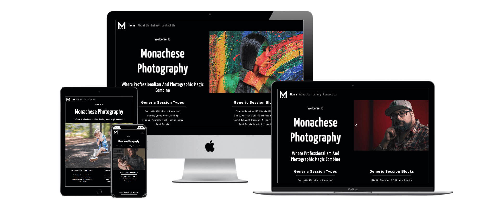
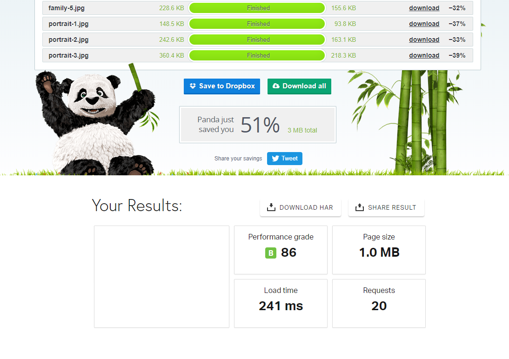

#   onachese Photography

The purpose of this site is to showcase an independent photographer's gallery, demonstrate their ability to digitally enhance photos, and to advertise photo 
sessions and editing packages to meet the photography needs of potential clients. A majority of the images showcased cater to parents and grandparents, however 
these also may appeal to a smaller market of young adults seeking business portraits and clients who wish to digitally enhance photographs.

# Live Protype Demo and WireFrame
+ An active prototype can be found [here](https://richardaeld.github.io/MonaMemorabilia/ "Web Page") at GitHub.
+ The wireframe PNG's can be found [here](https://github.com/Richardaeld/MonaMemorabilia/tree/master/assets/wireframe "Wireframe") also embedded at GitHub.

# UX Choices
 

### Home
+ Shows off four eye-catching photos, in a bootstrap carousel, for potential clients to get an impression of the photographer’s style.
+ Gives a brief description of the general services offered through a responsive layout that makes use of negative space to increase user readability.

### Main Nav
+ Includes a clean, responsive bootstrap nav bar where potential clients can clearly view the navigation bar on all devices.
+ Provides a clear display of the company logo in the top left corner.

### Main Footer
+ Uses Fontawesome icons paired with text to display a contemporary social link design which will appeal to potential clients of all ages.
+ Added social links than an independent photographer would use so that potential clients can view their work across multiple popular social platforms.

### About Us
+ Features a Hero image which demonstrates the photographer’s ability to digitally enhance photos. This shows potential clients his skill and artistic style.
+ Features a no-frills text section which emphasizes the exceptional work offered by the photographer and will assure potential clients that they will receive 
    the best treatment.
 
### Gallery
+ In order to make the four sub-gallery links stand out, the page utilizes negative space and a gray background-color which emphasizes and draws the eyes toward the image links.
+ Images on the page include a hover and scale feature to make it clear to clients which gallery they are selecting.

### Sub-Galleries (All Pages That Are Linked From Within Gallery)
+ To provide a more convenient navigation experience, users can click on a picture which will jump to the desired photo. Below each photo, another link allows the  user to jump back up to the top of the page.
+ To navigate easily between galleries, a back button to the main gallery was included in each sub-gallery.
+ To make each image stand out to potential clients, all images have an added border and box-shadow to give a three-dimensional effect that provides contrast with the page background-color.

### Contact Us
+ Contains a simple submission form which prevents clients from accidentally submitting the form without completing the contact information.
+ The final box (Describe Your Session needs...) includes plenty of space for clients to submit a substantial, well-thought out response.

### Image Compression
+ After using [TinyPNG](https://tinypng.com/) image compression, roughly 51% of the kb load from images was eliminated
+ According to [Pingdom](https://tools.pingdom.com/) the reduction in image size allowed the pages to load in approximately 0.250 seconds 

# Brand Identity
+ The headers (h1, h2…) *font-families* match the style of the logo
+ The main page color scheme uses the monochromatic coloration of the logo
+ The pictures used maintain themes of family, digital enhancement, and demonstrate the photographer’s artistic style

# Potential Client Examples
## Clients 
+ As a client, I'd like a framable photograph for a gift.
+ As a client, I'd like a portrait photograph for a work portfolio.
+ As a client, I'd like a photograph that I already own to be digitally improved. 
+ As a client, I'd like a photographer to attent a family event to capture candid photos.
+ As a client, I'd like a photo session for a non-conventional project 
+ As a client, I'd like a studio photo session with my family

# Testing
## Checking Responsiveness 
### Pages should have good UX at a starting resolution of 320*px* *width* by 568*px* *height* and past 1200*px* *width*  
#### Assumptions:
1. Using latest version of Chrome 
1. A monitor that supports 1080p resolution or greater 

#### Testing steps:
1. Open index page in Chrome 
1. Open inspect mode in Chrome browser
1. Click Responsive tab, underneath the browser address bar, and select an untested device type
1. Check for visual bugs, misalignments, or bad UX at every single size
1. Document any problem area or abnormal occurrence witnessed
1. Select "Rotate" (which is located to the right of the Responsive tab)
1. Repeat step three through six until all media sizes available have been tested 
1. Select Responsive tab and select the responsive function
1. Stretch screen *width* from 320*px* to 1200*px* and beyond
1. Check for visual bugs, misalignments, or bad UX as the pixel *width* is increased
1. Document any problem areas or abnormal occurrences

#### Expected result:
1. Documentation of all bad UX and where it occurs
1. Documentation of where visual bugs or misalignments occure
--------------------------------
## Checking for Errors in Code
### Code should not return errors 
#### Precondition: 
1. Website has been deployed 

#### Assumptions:
1. Know that vendor extensions do not validate and can be ignored
1. Know that not all warnings given will show code that requires change 
1. Know that external resources, like Bootstrap, return errors and warnings that do not concern this process

#### Testing Steps:
1. Open website, copy its index link, and leave open
1. Open another tab in browser and go to [W3C Markup Validation Service](https://validator.w3.org/)
1. Paste the link of the website page into W3C's validation bar and submit it to see what W3C finds
1. Document errors and warnings that need to be corrected
1. Repeat steps three and four until all pages have been checked in W3C
1. Open a tab in browser and go to  [Jigsaw (CSS Validation Service)](https://jigsaw.w3.org/css-validator/)
1. Paste the index page link into Jigsaws's validation bar and submit it to see what Jigsaw finds
1. Document errors and warnings that need to be corrected

#### Expected result:
1. List of problem code and where in the page(s) it can be found   
---------------------------------
## Checking for browser support
### Should not return time out, have an error, or grapical misalignment when viewed 
#### Assumption:
1. Know what the index page is supposed to look like at different resolutions

#### Testing Steps:
1. Open website, copy its index link, and leave open
1. Open another tab in browser and go to [browser Stack Screenshots](https://www.browserstack.com/screenshots)
1. Paste the link of the index page into Browser Screenshots "testing bar"
1. Pick a device or operating system and select the most current versions of browsers supported by the selected operating system
1. Repeat step four until there are 25 browser and/or device combinations
1. Click "Generate" and wait for results to finish
1. View each screenshot to check for image accuracy
1. Document the successful browser and/or  device combinations
1. Click "Back to Devices" and clear all previous selections
1. Repeat steps four through nine until all operations systems(with browser combinations) and devices are documented

#### Expected result:
1. List of supported operating system browsers combinations and devices 

+ Actual Browserstack results for this site can be found [here](https://github.com/Richardaeld/MonaMemorabilia/tree/master/assets/browserstack)
----------------------------------
## Checking for webpage load times
### Should return a load time for each page
#### Precondition: 
1. Website has been deployed

#### Testing Steps:
1. Open website, copy its index link, and leave open
1. Open another tab in browser and go to [Pingdom](https://tools.pingdom.com/)
1. Paste the link of the page into Pingdom's "URL" bar
1. Select the location, North America-USA-San Francisco from the "Test from" drop down menu
1. Click "Start Test" and wait for the results
1. Record Results
1. Repeat steps three through six until all pages have been tested
#### Expected result:
1. List of load times for site

+ Actual Pingdom results for this site can be found [here](https://github.com/Richardaeld/MonaMemorabilia/tree/master/assets/pingdom)

## Previous and Current Bugs
+ During the programming of this webpage, there were numerous graphical misalignments. These were primarily generated by Bootstrap creating 
    padding and margins and was the result of using rows and container-fluid commands. These were easily taken care of with appropriate padding 
    and margin removal and the use of "!important".
+ Various pages were not filling the entire screen on specific interface devices when using the inspect function in Chrome. By matching the 
    body’s default *background-color* to the footer’s *background-color*, it gives the illusion that the footer's *background-color* extends 
    to the bottom of the screen.
+ The file "Core.python3.2641.1592707923" will crash GitPod when attempting to delete it.
+ When viewing all sub-galleries at an i5 resolution in landscape (568px x 320px) while using the Chrome inspect function, the top and bottom 
    borders of photos cannot be seen due to the size of the nav bar and the physical limitations of the pixels on the screen.

## Operating system and browser combinations with confirmed Support
#### All Browsers must be current version
+ Windows 10
    + Chrome, Internet Explorer, Firefox
+ Windows 8.1, 8.0, 7 
    + Chrome and Internet Explorer
+ Mac OS X Catalina and Mojave
    + Chrome
+ Mac OS X High Sierra, Sierra, and El Capitan
    + Safari and Chrome
+ Mac OX X Yosemite and Mavericks
    + Chrome

## Scalability
+ Adding a user operable slide-bar to change images from the original to an edited version could offer better representation on the digital 
    enhancement section and in the About Us section (This feature is outside the scope of this project)
+ The use of a modal in the sub-gallery pages would allow for pictures to pop up instead of relying on a clunky in-page nav
+ Changing *px* to *rem* in CSS would help reduce code length in CSS and add better responsiveness to all pages on smaller devices

# Tool, References, and Code Used
## Tools
+ [Balsmiq](https://balsamiq.com/) - Helped produce the wireframe used for this web page
+ [Bootstrap](https://getbootstrap.com/) - Used as framework
+ [BrowserStack](https://www.browserstack.com/screenshots) - Checking for platform incompatibility
+ [Fontawesome](https://fontawesome.com/v4.7.0/icons/) - Icons used
+ [GitHub](https://github.com/) - Deployment of prototype site
+ [GitPod](https://www.gitpod.io/) - Integrated development environment
+ [Google fonts](https://fonts.google.com/) - Fonts used
+ [Jigsaw(Validation Service)](https://jigsaw.w3.org/css-validator/) - Used to identify errors in CSS
+ [Pingdom](https://tools.pingdom.com/) - Checking for page load time
+ [Techsini](https://techsini.com/multi-mockup/) - for their viewable responsiveness PNG
+ [TinyPNG](https://tinypng.com/) - Minimizing KB load per image
+ [W3C Validator](https://validator.w3.org/) - Used to identify errors in markup

## References and Code used
+ [Webaccessibilitychecklist](http://webaccessibilitychecklist.com/) - Helped with making web page ARIA accessible
+ [MDN web docs](https://developer.mozilla.org/en-US/docs/Learn/Accessibility/What_is_accessibility) - Helped with understanding of when and how to use ARIA
+ [Stack overflow](https://stackoverflow.com/) - Helped in understanding how to correct visual bugs with Bootstrap's automatic padding and margins
+ [TestLodge](https://blog.testlodge.com/how-to-write-test-cases-for-software-with-sample/) - Used for test case exmples
+ [W3schools](https://www.w3schools.com/) - Helped with fine-tuning CSS and provided examples of advanced tricks involving *transition*, *hover*, and *scale*. These can be seen in:
    1. Index (*Hover* button effects are found under "Custom Project" and *text-shadow* is used on the busisness name, Monachese Photography)
    2. Main footer (*Hover* effect used for the social media icons)
    3. Gallery and sub-galleries (All nav images use the *scale* effect and a *box-shadow*)
    4. Sub-galleries (The clickable images use a *scale* and *transition* effect. The other images use *box-shadow*)
+ [Bootstrap](https://getbootstrap.com/) -
  1. Main nav (Used responsive design nav bar)
  2. Index (Image carousel)
  3. Contact us (Form)
  4. Sub-Gallery (Scrollspy was used for the in-page nav and the *invisible* properity was used to hide placement of in-page nav snap-to points)
+ Code Institute (Class) - Used footer design based on the golden ratio and made social links like the examples shown in class
+ Used a visual reference from a classmate (Simon "jumboduck") for the About Us section. The idea that was used is a large Hero image followed by the golden 
    ratio of three text boxes that share the *background-color* of the page.

# Technologies
## Languages
+ HTML
+ CSS
+ JS (with Bootstrap)
+ JQuery (with Bootstrap)

# Acknowledgements
+ The idea for this website came from Micheal Monachese because of his forte for photography
+ The photos and logo were created by Micheal Monachese
+ Felipe Souza Alarcon for guidance and providing a plethora of information and web-based applications
+ Emily Grooms for help in revising this README document
